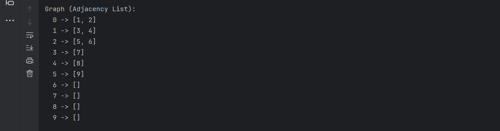
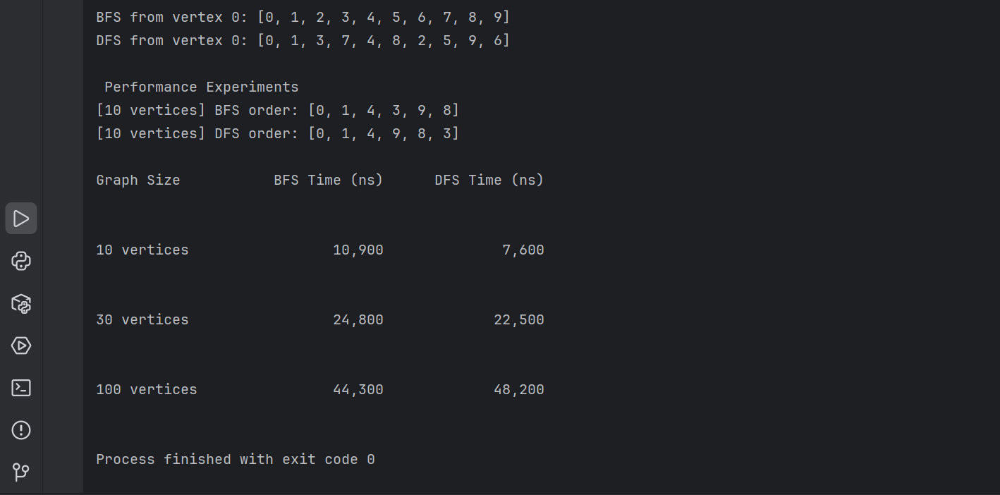

# Assignment 4: Graph Traversal and Representation System
# Student: Pribylyov Yegor
# Group: SE-2514

## A. Project Overview

This project implements a Graph Traversal and Representation System in Python. A graph consists of vertices (nodes) and edges (connections between nodes).
The graph is represented using an Adjacency List. Two traversal algorithms are implemented: BFS and DFS.

## B. Class Descriptions

### Vertex (src/vertex.py)
Represents a node in the graph.
Private field: id — unique integer identifier
Methods: __init__, get_id(), __str__()

### Edge (src/edge.py)
Represents a directed connection between two vertices.
Private fields: source, destination
Methods: __init__, get_source(), get_destination(), __str__()

### Graph (src/graph.py)
Represents the graph using an adjacency list.
Methods: add_vertex(), add_edge(), print_graph(), bfs(), dfs()

### Experiment (src/experiment.py)
Handles performance testing.
Methods: run_traversals(), run_multiple_tests(), print_results()

## C. Algorithm Descriptions

### BFS  Breadth-First Search
1. Mark starting vertex as visited, add to queue
2. While queue is not empty — dequeue, add to result, enqueue unvisited neighbors
Use case: shortest path, level-order traversal
Time complexity: O(V + E)

### DFS  Depth-First Search
1. Mark starting vertex as visited
2. Recursively visit all unvisited neighbors
Use case: cycle detection, maze solving
Time complexity: O(V + E)

## D. Experimental Results
| Graph Size   | BFS Time (ns) | DFS Time (ns) |
|--------------|---------------|---------------|
| 10 vertices  | 10,900        | 7,600         |
| 30 vertices  | 24,800        | 22,500        |
| 100 vertices | 44,300        | 48,200        |
### Observations
Both algorithms grow linearly  matches O(V + E)
BFS and DFS show similar performance
Results confirm expected theoretical complexity
## E. Screenshots

### Graph Structure

### BFS, DFS and Performance

## F. Reflection
Working on this assignment gave me a clear understanding of BFS and DFS differences. BFS explores level by level using a queue, while DFS goes deep using recursion.
The hardest part was building the adjacency list with separate Vertex and Edge classes. Both algorithms have O(V + E) complexity which was confirmed by the experiments.
